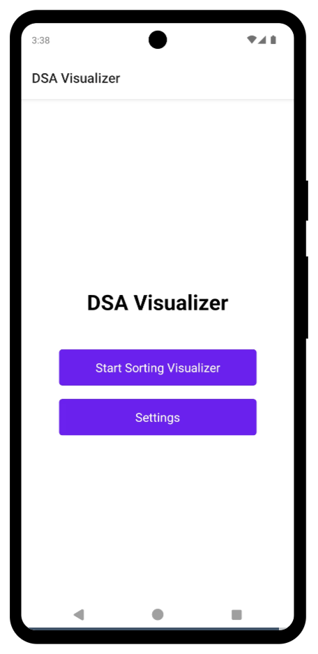
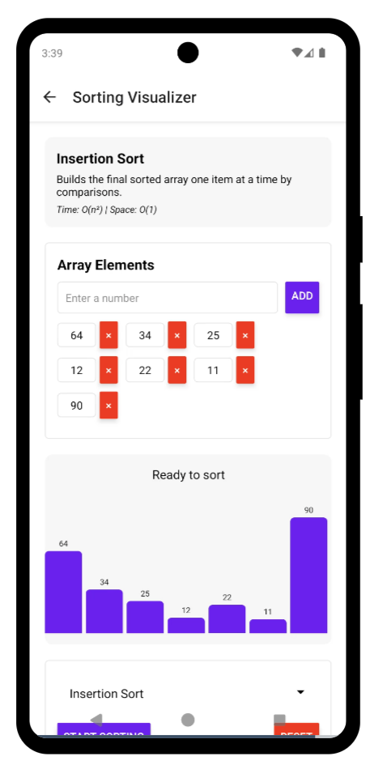
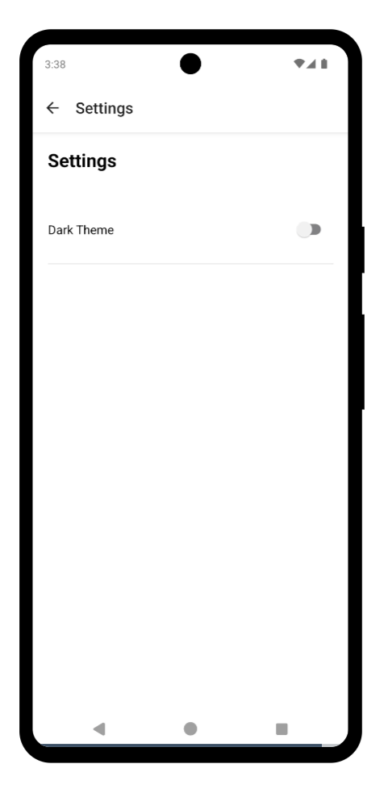

# 📊 DSA Visualizer App

A React Native app that visualizes sorting algorithms (currently Insertion Sort and Bubble Sort) with interactive animations and explanations.

---

## ✨ Features

- 🔄 **Interactive visualization** of Insertion Sort and Bubble Sort
- 🧠 **Step-by-step animation** with educational explanations
- 🧩 **Array manipulation** – add, edit, and delete elements
- 🌗 **Dark/Light theme toggle**
- 🧭 **Multi-screen navigation** using React Navigation

---

## 📸 Screenshots

> Make sure the image files exist at `assets/screenshots/` and are committed to your Git repository.

### 🏠 Home Screen


### 📊 Sort Visualizer


### ⚙️ Settings


---

## ⚙️ Setup

### 1. Clone the repository

```bash
git clone https://github.com/your-username/DSAVisualizer.git
cd DSAVisualizer
